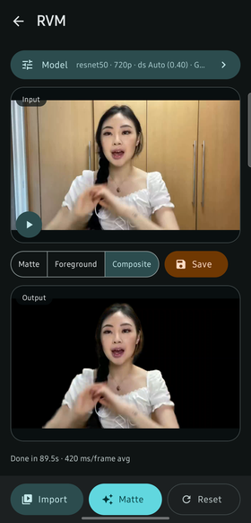
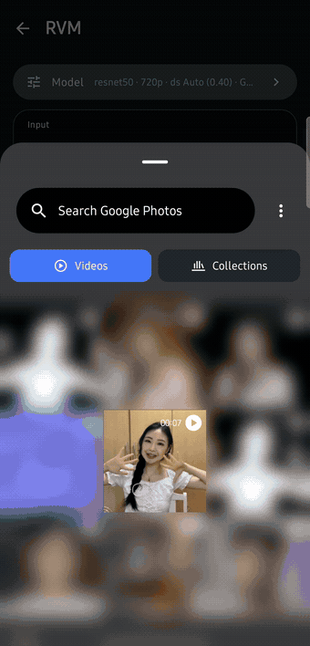
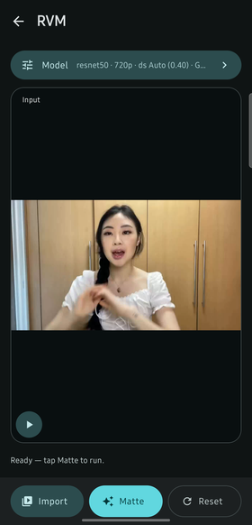
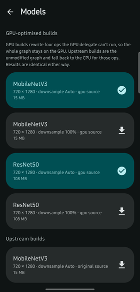

# On-Device Robust Video Matting

**Human video matting that runs entirely on an Android phone.**

This project takes [Robust Video Matting (RVM)](https://github.com/PeterL1n/RobustVideoMatting) —
a recurrent, auxiliary-free neural matting model — converts its PyTorch checkpoints into TensorFlow
Lite / LiteRT models that a mobile GPU can execute end to end, and ships an Android app that runs
them locally to separate a person from their background in a video. No frame ever leaves the
device; the network is used only once, to fetch the model weights.

<p align="center">
  
</p>
<p align="center"><em>Alpha matte (left) and composite (right), produced on-device from one 7-second clip in a single pass.</em></p>

<p align="center">
  
  
  
</p>
<p align="center"><em>Home &middot; alpha matte &middot; composite.</em></p>

### The whole pipeline, on-device

<p align="center">
  <a href="rvmDocumentation/video/rvm-walkthrough.mp4">
    
  </a>
</p>
<p align="center">
  <em>Pick a clip &rarr; a 213-frame run (time-lapsed here) &rarr; matte, foreground and composite.<br />
  Recorded on a Galaxy S23 FE; other people's thumbnails in the system picker are blurred.</em><br />
  <a href="rvmDocumentation/video/rvm-walkthrough.mp4"><strong>▶ Full walkthrough (2:17)</strong></a> — the same run at real speed, with idle time trimmed.
</p>

---

## Contents

- [Why this exists](#why-this-exists)
- [Repository layout](#repository-layout)
- [How it works](#how-it-works)
- [Quick start](#quick-start)
- [Pre-converted models](#pre-converted-models)
- [Performance](#performance)
- [The GPU-delegate problem](#the-gpu-delegate-problem)
- [Documentation index](#documentation-index)
- [Known limitations](#known-limitations)
- [Credits and references](#credits-and-references)
- [License](#license)

---

## Why this exists

RVM produces high-quality alpha mattes from ordinary video without a green screen or a trimap, but
it ships as a PyTorch model aimed at desktop GPUs. Getting it onto a phone raises three separate
problems, and this repository solves each in its own component:

1. **Export.** RVM's graph is recurrent and dynamically shaped. `torch.export` needs static shapes,
   and the model's temporal state has to become explicit tensor inputs and outputs.
2. **Acceleration.** A naive TFLite export runs only on the CPU: four ops in the upstream graph are
   rejected by the TFLite GPU delegate, and because the delegate is all-or-nothing once attached,
   a single unsupported op costs you the entire GPU. Fixing this is the difference between
   ~930 ms and ~278 ms per frame.
3. **Delivery.** The weights are ~120 MB for the two default models and ~475 MB for all eight, far
   too large to bundle into an APK, so the app downloads and verifies them at runtime.

The result is a full, reproducible path from an upstream research checkpoint to a signed APK you
can install on a phone.

## Repository layout

The repository is organised as one directory per component. Work happens on a per-component branch
(`application`, `converter`, `documentation`) and lands on `main`, which carries everything:

```
On-Device-Robust-Video-Matting/
├── README.md              # this file — project overview
├── rvmApplication/        # the Android app (Kotlin, Jetpack Compose, TFLite/LiteRT)
├── rvmConverter/          # PyTorch → TFLite conversion, verification and benchmarking toolkit
└── rvmDocumentation/      # shared documentation assets (screenshots used above)
```

| Component | What it is | Start here |
| --- | --- | --- |
| **[`rvmApplication/`](rvmApplication/README.md)** | Android app: pick a video, run RVM over every frame on-device, get alpha matte + foreground + composite back, play them in sync and save them to the gallery. | [Developer README](rvmApplication/README.md) &middot; [User guide](rvmApplication/USER_GUIDE.md) |
| **[`rvmConverter/`](rvmConverter/README.md)** | Converts RVM checkpoints to `.tflite`, verifies each export numerically against PyTorch, and benchmarks it on a real device's CPU and GPU delegate. Vendors upstream RVM plus a GPU-delegate-compatible copy of its model source. | [Converter README](rvmConverter/README.md) |

## How it works

```
  RVM checkpoint (.pth)                                    rvmConverter
        │
        ├─ RVMWrapper           NHWC ⇄ NCHW, 0–255 ⇄ [0,1], explicit r1–r4 state tensors
        ├─ model_gpu/           four ops rewritten for TFLite GPU-delegate compatibility
        ├─ litert_torch.convert static shapes, fixed downsample ratio baked in
        ├─ verify.py            exported .tflite vs. PyTorch, per-output PASS/FAIL
        └─ benchmark/           on-device CPU + GPU timings via adb
        │
        ▼
  8 published .tflite models  ──►  GitHub release `models-v1`
        │
        ▼                                                  rvmApplication
  ModelDownloader → ModelStore (filesDir/models/, size-verified)
        │
        ▼
  Controller: for each frame ──► VideoFrameDecoder
                                      │
                                      ▼
                             MatteModule (TFLite interpreter, GPU/NNAPI/CPU)
                             carries hidden states r1–r4 frame to frame
                                      │
                       ┌──────────────┼──────────────┐
                       ▼              ▼              ▼
                     alpha        foreground   fg × alpha composite
                       └──────────────┼──────────────┘
                                      ▼
                          3 × VideoFrameEncoder → 3 output videos
```

Each frame is decoded, run through the model, and written to three encoders in a **single
decode/inference pass**. RVM is recurrent, so the four ConvGRU hidden states produced by one frame
are fed back as inputs to the next — that is what keeps the matte temporally stable instead of
flickering frame to frame. Every stateful native resource (the interpreter and its GPU delegate,
each `MediaCodec`/`MediaMuxer`, the decoder) is confined to its own dedicated thread, because none
of them are safe to drive from more than one.

## Quick start

### I just want to use the app

Download **[`rvm-1.0.apk`](https://github.com/Hardikagrwl03/On-Device-Robust-Video-Matting/releases/download/app-v1.0/rvm-1.0.apk)**
from release [`app-v1.0`](https://github.com/Hardikagrwl03/On-Device-Robust-Video-Matting/releases/tag/app-v1.0)
and open it on your phone.

| | |
| --- | --- |
| Version | 1.0 (`versionCode` 1) |
| Requires | Android 15+ (`minSdk 35`), 64-bit ARM (`arm64-v8a`) |
| Size | 209 MB APK, plus ~120 MB of models downloaded on first launch |
| SHA-256 | `e5681d7145c24def0e000ff68be67a21aba38acc8531f37dff725b38200c4d1d` |

The APK contains no model weights — **use Wi-Fi on the first launch.** The app becomes usable as
soon as the first (~15 MB) model lands, while the larger one keeps downloading. Full walkthrough,
with every setting explained: **[`rvmApplication/USER_GUIDE.md`](rvmApplication/USER_GUIDE.md)**.

| Import a clip | Run | Pick a model |
| :---: | :---: | :---: |
|  |  |  |

### I want to build the app

```bash
git clone git@github.com:Hardikagrwl03/On-Device-Robust-Video-Matting.git
cd On-Device-Robust-Video-Matting/rvmApplication
./gradlew assembleDebug
```

Open the folder in Android Studio, or use the wrapper directly. You need JDK 11, the Android SDK
(`compileSdk 37`), and an `arm64-v8a` device or `x86_64` emulator on API 35+. No model files are
needed at build time. Details, release signing and ABI packaging:
**[`rvmApplication/README.md`](rvmApplication/README.md)**.

### I want to convert or re-export the models

```bash
cd On-Device-Robust-Video-Matting/rvmConverter
conda env create -n rvm-convert -f environment.yaml && conda activate rvm-convert

# fetch the upstream checkpoints into RobustVideoMatting/checkpoints/, then:
./run.sh --variant mobilenetv3 --source gpu --backend gpu   # convert → compare → verify → benchmark → visualize
```

`run.sh` chains the whole pipeline for one variant; each stage is also available on its own
(`scripts/convert.sh`, `verify.sh`, `compare.sh`, `benchmark.sh`, `visualize.sh`). Details:
**[`rvmConverter/README.md`](rvmConverter/README.md)**.

## Pre-converted models

Eight models are published on the GitHub release
**[`models-v1`](https://github.com/Hardikagrwl03/On-Device-Robust-Video-Matting/releases/tag/models-v1)** —
two backbones × two sources × two downsample settings, all at `720×1280`:

```
rvm_<source>_<backbone>_<height>x<width>_ds_<downsampleTag>.tflite
```

| Backbone | Source | `ds` | Size | GPU delegate |
| --- | --- | --- | --- | --- |
| MobileNetV3 | `gpu` | `auto` | ~15 MB | ✅ full |
| MobileNetV3 | `gpu` | `100` | ~15 MB | ✅ full |
| ResNet50 | `gpu` | `auto` | ~103 MB | ✅ full |
| ResNet50 | `gpu` | `100` | ~103 MB | ✅ full |
| MobileNetV3 | `original` | `auto` / `100` | ~15–16 MB | ❌ CPU only |
| ResNet50 | `original` | `auto` / `100` | ~103–104 MB | ❌ CPU only |

- **`source`** is *which copy of the RVM PyTorch source the model was traced from*, decided at build
  time — `gpu` rewrites four ops for GPU-delegate compatibility, `original` is the unmodified
  upstream graph. This is **not** the same thing as the compute device chosen at runtime; the
  `original` builds exist as a numerical and performance baseline, not for production use.
- **`ds`** is the downsample ratio baked into the traced graph: `100` = ratio 1.0 (no downsampling,
  RVM's refiner branch is never traced), `auto` = RVM's own `min(512 / max(h, w), 1)` heuristic,
  which at `720×1280` resolves to 0.40.

The app downloads these URLs directly and, since the release publishes no checksums, verifies each
file against a hardcoded byte size in `ModelManifest.ALL`. The same files are also mirrored on
[Google Drive](https://drive.google.com/drive/folders/1VXIsAFNzCVJ-ylWkxmL_tJxKAAFb992K?usp=sharing).

## Performance

**Raw inference**, measured with TFLite's `benchmark_model` on a Galaxy S23 FE, `720×1280` input,
average over 10 runs with op profiling enabled (`benchmark/benchmark_{cpu,gpu}.sh`). Every log is
committed under `rvmConverter/benchmark/`:

| Backbone | `ds` | CPU (XNNPACK) | GPU delegate | Speed-up |
| --- | --- | ---: | ---: | ---: |
| MobileNetV3 | `auto` (0.40) | 745 ms | **135 ms** | 5.5× |
| MobileNetV3 | `100` (1.0) | 1084 ms | **328 ms** | 3.3× |
| ResNet50 | `auto` (0.40) | 1162 ms | **278 ms** | 4.2× |
| ResNet50 | `100` (1.0) | 3809 ms | **847 ms** | 4.5× |

The `original`-source builds run at broadly the same CPU speed (713–3300 ms) but **cannot use the
GPU delegate at all** — see below.

**End-to-end in the app** (decode + inference + three encodes per frame), Galaxy S23 FE
(`SM-S711B`, Exynos 2200 / Samsung Xclipse 920), `720×1280` input, `ds auto`, GPU delegate:

| Model | Per frame | 7 s clip (213 frames) |
| --- | ---: | ---: |
| `gpu` / MobileNetV3 | ~320 ms | ~68 s |
| `gpu` / ResNet50 | **408 ms** | **86.9 s** |

The ResNet50 row is a measured run — the app's own completion strip reported
`Done in 86.9s · 408 ms/frame avg`; the full walkthrough video above is that exact run.

## The GPU-delegate problem

This is the core technical finding of the project, and the reason `rvmConverter` carries two copies
of the RVM model source.

Several idiomatic PyTorch ops decompose, under `torch.export`'s TFLite lowering, into fused or
generic ops that the TFLite **GPU delegate** does not implement — even though they run fine on CPU
via XNNPACK. And the delegate is not gracefully partial: on the upstream graph it claims only
84–104 of 183–295 nodes, splits the model into 2–3 partitions, then fails outright with
`TfLiteGpuDelegate Prepare: delegate is not initialized`. The whole model falls back to the CPU.

`RobustVideoMatting/model/` is kept byte-identical to upstream and is never edited.
`RobustVideoMatting/model_gpu/` is a parallel copy where four ops are rewritten — each as an *exact
algebraic equivalent*, confirmed by `compare.py` to differ by `max_diff = 0.000000` against the
original in pure PyTorch:

| File | Original op | Rejected as | Rewrite |
| --- | --- | --- | --- |
| `lraspp.py` | `nn.AdaptiveAvgPool2d(1)` | `GATHER_ND` / `STABLEHLO_REDUCE_WINDOW` | `x.mean(dim=(-2,-1), keepdim=True)` |
| `mobilenetv3.py` | `SqueezeExcitation.avgpool` (torchvision) | `GATHER_ND` | same global-average-pool, swapped in by module surgery |
| `decoder.py` | `nn.AvgPool2d(2, 2, ceil_mode=True, count_include_pad=False)` | `STABLEHLO_REDUCE_WINDOW` | plain `nn.AvgPool2d(2, 2)` |
| `model.py` | `x.clamp(0., 1.)` | `RELU_0_TO_1` | `F.relu(x) - F.relu(x - 1)` |

With all four in place, both backbones report
`the model graph will be completely executed by the delegate` — zero CPU fallback, and the 3–5×
speed-up in the table above. Because the rewrites are numerically exact, a `gpu`-source model is
never worse than an `original` one on any compute device.

A fifth, unrelated fix lives in `wrapper.py`: `torchvision`'s `normalize` contains an
`if (std == 0).any(): raise ...` guard that `torch.export`'s tracer cannot statically resolve
(`GuardOnDataDependentSymNode`), so a check-free replacement is monkeypatched in.

## Documentation index

| Document | Audience | Covers |
| --- | --- | --- |
| [`rvmApplication/USER_GUIDE.md`](rvmApplication/USER_GUIDE.md) | End users | Installing, first launch, making a matte, saving, every setting explained — no code |
| [`rvmApplication/README.md`](rvmApplication/README.md) | App developers | Architecture, the generic module pattern, thread confinement, model delivery, logging, release process |
| [`rvmConverter/README.md`](rvmConverter/README.md) | ML / conversion | `convert.py`, `verify.py`, `compare.py`, benchmarking, op-graph visualisation, the `model`/`model_gpu` split |
| [`rvmApplication/docs/`](rvmApplication/docs/) | App developers | Design documents: `threading-plan.md`, `model-download-plan.md`, `ui-plan.md`, `ui-redesign-plan.md` |
| `.claude/skills/` in each component | Contributors | Eleven project-scoped Claude Code skills documenting setup, architecture, models, UI, verification, release, conversion, benchmarking and the GPU-delegate fix recipe |

## Known limitations

Real constraints of the current pipeline, not bugs to be surprised by:

- **Outputs carry no audio track** — the encoder writes video only.
- **Outputs are always 1280×720**, and the pipeline effectively assumes a `720×1280` input; a
  differently-shaped source under- or over-fills the frame buffer.
- **Model downloads do not resume** — a transfer killed with the process restarts from zero.
- **Live Matte (real-time camera matting) is not implemented** — the tile shows a "coming soon"
  toast.
- Processing is offline and roughly real-time-and-a-half at best: budget ~0.3–0.5 s per frame, so
  start with clips of 5–10 seconds.

## Credits and references

This project is an on-device port. All model architecture and training credit belongs to the
original RVM authors:

> **Robust High-Resolution Video Matting with Temporal Guidance**
> Shanchuan Lin, Linjie Yang, Imran Saleemi, Soumyadip Sengupta
> *IEEE/CVF Winter Conference on Applications of Computer Vision (WACV), 2022*
> [arXiv:2108.11515](https://arxiv.org/abs/2108.11515) &middot;
> [Project page](https://peterl1n.github.io/RobustVideoMatting/) &middot;
> [GitHub](https://github.com/PeterL1n/RobustVideoMatting)

```bibtex
@inproceedings{lin2022robust,
  title     = {Robust High-Resolution Video Matting with Temporal Guidance},
  author    = {Lin, Shanchuan and Yang, Linjie and Saleemi, Imran and Sengupta, Soumyadip},
  booktitle = {Proceedings of the IEEE/CVF Winter Conference on Applications of Computer Vision (WACV)},
  pages     = {238--247},
  year      = {2022}
}
```

Built on [TensorFlow Lite / LiteRT](https://ai.google.dev/edge/litert),
[`litert-torch`](https://github.com/google-ai-edge/LiteRT) for the PyTorch export path,
[Jetpack Compose](https://developer.android.com/compose) and
[Media3](https://developer.android.com/media/media3) on the Android side, and
[netron](https://netron.app/) for op-graph visualisation.

## License

The vendored upstream RVM source under `rvmConverter/RobustVideoMatting/` is
**[GPL-3.0](rvmConverter/RobustVideoMatting/LICENSE)**, as published by its authors. Because the
converted `.tflite` models are derived from the official RVM checkpoints and the conversion
toolkit imports that source directly, GPL-3.0 governs those too — factor that in before reusing
this work in a closed-source product.
