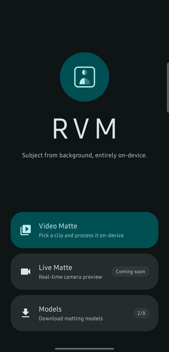
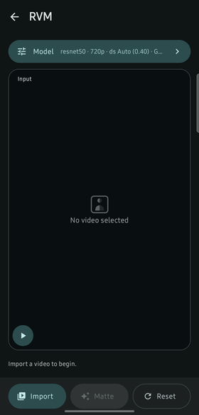
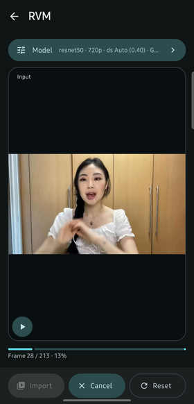
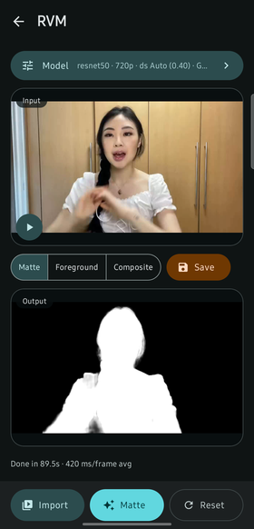
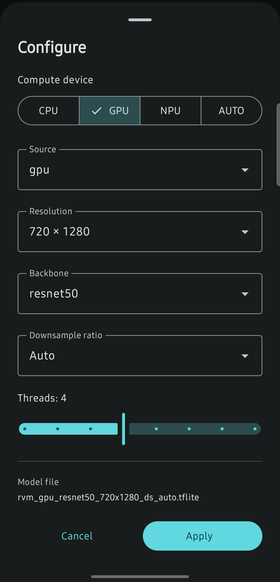

# Application for On-Device Robust Video Matting

An Android application that runs [Robust Video Matting (RVM)](https://github.com/PeterL1n/RobustVideoMatting) fully on-device via TensorFlow Lite / LiteRT to produce an alpha matte, a foreground extraction, and their composite for a user-selected video, with GPU/NNAPI acceleration where available.

> **Just want to use the app?** See **[USER_GUIDE.md](USER_GUIDE.md)** — installing, first run,
> and every setting explained without reference to the code. The rest of this README is for
> developers working on the app itself.

| Home | Composite output | Models |
| :---: | :---: | :---: |
|  |  |  |

## Overview

The user picks a video from their device, the app decodes it frame-by-frame, runs each frame through an on-device RVM TFLite model (carrying the model's recurrent hidden states between frames for temporal consistency), and re-encodes the result into three output videos in a single decode/inference pass:

- the **alpha matte** (grayscale opacity mask),
- the **foreground** (the subject as RVM extracts it), and
- their **composite** — `foreground × alpha` per pixel, i.e. the subject matted onto black with soft, opacity-weighted edges rather than a hard cutout.

All three play back in-app, kept in sync with the input video, and can be saved to the device gallery in one tap.

### Measured performance

On a Galaxy S23 FE (Snapdragon 8 Gen 1), 720x1280 input, `ds auto`, GPU delegate:

| Model | Per frame | 7 s clip (213 frames) |
| --- | --- | --- |
| `gpu` / mobilenetv3 | ~320 ms | ~68 s |
| `gpu` / resnet50 | ~420 ms | ~90 s |

An `original`-source model is forced onto the CPU and is substantially slower; it exists for
comparison against the `gpu` rewrites, not for production use.

### Known limitations

These are real constraints of the current pipeline, not bugs to be surprised by:

- **Outputs carry no audio track.** `VideoFrameEncoder` writes video only.
- **Outputs are always `config.width` x `config.height` (1280x720)** regardless of the input's
  dimensions, since the encoders are started from the config, not the source video.
- **The pipeline effectively assumes a 720x1280 input.** `VideoFrameDecoder.getNextFrame` loads a
  bitmap at the *source* video's dimensions into a buffer sized from the config, so a
  differently-shaped input under- or over-fills it.
- **Model downloads do not resume.** A transfer killed with the process restarts from zero.
- **Live Matte is not implemented** — the tile shows a "coming soon" toast.

## Features

- On-device video matting using RVM — inference is entirely local; the network is used only to fetch model weights.
- Models are **downloaded on demand** from the [`models-v1` GitHub release](https://github.com/Hardikagrwl03/On-Device-Robust-Video-Matting/releases/tag/models-v1) rather than bundled in the APK, with an in-app Models page to browse and install all eight builds; the two `gpu`/`auto` models are fetched automatically on first launch. See `docs/model-download-plan.md`.
- Selectable compute backend per run: GPU delegate, NNAPI (NPU), CPU, or automatic fallback (NNAPI → GPU → CPU).
- Two RVM backbones (ResNet50, MobileNetV3), two converter sources (`gpu`/`original`) and configurable resolution/downsample ratio, each resolving to a matching `.tflite` actually **downloaded** into `filesDir/models/` (the config UI can't offer a combination that isn't installed).
- Frame-accurate hidden-state passing between inference calls, matching RVM's recurrent architecture.
- One decode/inference pass produces all three outputs — alpha matte, foreground, and their premultiplied composite — switchable in-app and played back in sync with the input; all three (plus the input) can be saved to `Movies/RVM` in the gallery.
- Native Jetpack Compose UI: a home screen, a non-scrolling matting screen with synchronized Media3 input/output preview playback, and Save-to-gallery — see `docs/ui-redesign-plan.md` for the full design.
- Every stateful native resource — the TFLite interpreter/GPU delegate, each `MediaCodec`/`MediaMuxer` encoder, the `MediaMetadataRetriever` decoder — is confined to its own dedicated thread, since none of them are safe to drive from more than one thread (the GPU delegate in particular binds an EGL context to whichever thread builds it); see `docs/threading-plan.md`.

The app uses a fixed brand colour scheme (not Material You dynamic colour) so its look is consistent across devices; see `docs/ui-redesign-plan.md`, "Key decision 3", for why and for the full palette.

## Requirements

- Android Studio (Narwhal or newer recommended) with the Android SDK.
- JDK 11.
- An Android device or emulator running **API 35 (Android 15) or newer** (`minSdk = 35`, `targetSdk = 36`, `compileSdk = 37`).
- An **`arm64-v8a`** device, or an **`x86_64`** emulator. Those are the only two ABIs packaged: TFLite's native libraries are ~73 MB *per ABI*, and at `minSdk 35` nothing can reach the other two (no Android 15 device ships 32-bit-only ARM, and there are no x86 Android phones), so `armeabi-v7a` and `x86` are excluded via `ndk { abiFilters }` — see `app/build.gradle.kts`.
- Gradle 9.5 (fetched automatically via the Gradle wrapper), AGP 9.3.1, Kotlin 2.2.10.

## Getting Started

1. **Clone the repository** and open the `application/rvmApplication` folder in Android Studio.
2. **Sync and build** — Android Studio will resolve dependencies (TensorFlow Lite, LiteRT, Jetpack Compose, Media3, AndroidX) automatically via Gradle.
3. **Run** on a device/emulator meeting the API level requirement above. No model files are needed at build time — the app downloads what it needs on first launch (see below).

### How the TFLite models get onto the device

No `.tflite` file is committed to this repository or bundled into the APK. The app fetches them at
runtime from the [`models-v1` GitHub release](https://github.com/Hardikagrwl03/On-Device-Robust-Video-Matting/releases/tag/models-v1)
into internal storage at `filesDir/models/`, where they stay installed.

- **On first launch** the app automatically downloads the two `gpu`-source, `auto`-downsample
  models (MobileNetV3 ~15 MB, then ResNet50 ~104 MB, in that order). MobileNetV3 lands first
  deliberately: the app becomes usable as soon as it does, instead of waiting on the larger file.
- **The Models page** (from the home screen) lists all eight published builds with the converter
  config each was created with, and installs any of them on tap. Installed entries are marked with
  an accented card and a check.

Downloads run one at a time on a process-wide scope, so they survive navigating away from the
Models page — but **not** the process dying; there is no resume, so a killed transfer restarts.

Filenames are the release asset names verbatim, which is also what `MatteConfig` resolves to and
what `ModelStore` looks up — one string, no mapping layer:

```
rvm_<source>_<backbone>_<height>x<width>_ds_<downsampleTag>.tflite
```

- `<source>`: `gpu` or `original` — **which copy of the RVM PyTorch source the model was traced
  from**, a build-time property. `gpu` builds rewrite four ops the TFLite GPU delegate can't run;
  `original` is the unmodified upstream graph. This is *not* the same thing as the compute device
  selected at runtime — see the note below.
- `<backbone>`: `resnet50` or `mobilenetv3`
- `<height>x<width>`: input resolution — every published build is `720x1280`
- `<downsampleTag>`: a fixed downsample ratio as a zero-padded integer percentage (`100` = ratio
  1.0), or `auto` when resolved automatically from resolution

`MatteConfig()` (the default) resolves to `rvm_gpu_resnet50_720x1280_ds_auto.tflite`. If that
model isn't installed yet but another is, `MatteViewModel` configures the installed one instead
rather than failing.

Since the release publishes no checksums, `ModelManifest` records each asset's exact byte size and
`ModelDownloader` verifies both the server's `Content-Length` and the bytes written against it,
downloading into a `.part` file that is renamed only once the check passes. **If a `models-v1`
asset is ever re-uploaded, `ModelManifest.ALL` must be updated in the same commit** or every
install will reject the new file as a size mismatch.

> **`source` vs. compute device.** `source` picks *which file* to load; the compute device
> (`CPU`/`GPU`/`NPU`/`AUTO`) picks *which delegate* runs it. They're independent, and both are
> selectable in the config sheet — but not every pairing can run. An `original` model still
> contains the ops the `gpu` build rewrites (`GATHER_ND`, `RELU_0_TO_1`,
> `STABLEHLO_REDUCE_WINDOW`), and a delegate is mandatory once attached: rather than running just
> those ops on CPU, the GPU/NNAPI delegate refuses the whole graph and the interpreter fails to
> build.
>
> So applying `original` with `GPU` or `NPU` **forces the compute device to CPU** and says so in a
> toast, rather than accepting a selection that can't work. `AUTO` is left alone — falling back
> through NNAPI → GPU → CPU is exactly what it's for — and `TFLiteModelRunner` still catches a
> delegate rejection and degrades to CPU as a backstop for any pairing this check doesn't know
> about. Since the `gpu` rewrites are numerically exact, a `gpu`-source model is never worse than
> an `original` one at any compute device.

## Building a release APK

Release builds are signed with a keystore that is **deliberately not in version control**
(`.gitignore` excludes `*.keystore`, `*.jks` and `keystore.properties`). `app/build.gradle.kts`
reads `keystore.properties` from the project root:

```properties
storeFile=rvm-release.keystore
storePassword=...
keyAlias=rvm-release
keyPassword=...
```

If that file is absent the project still builds — `assembleRelease` simply produces an **unsigned**
APK — so a fresh clone isn't blocked by a missing secret.

```bash
./gradlew assembleDebug assembleRelease
# app/build/outputs/apk/debug/app-debug.apk
# app/build/outputs/apk/release/app-release.apk
```

Both are universal APKs carrying `arm64-v8a` + `x86_64` (see Requirements), so a single file can be
attached to a GitHub release and installed by any supported device. Signing uses the v3 scheme
(v1/v2 are redundant at `minSdk 35`, and v3 is what permits key rotation later). Verify with:

```bash
$ANDROID_HOME/build-tools/<version>/apksigner verify -v app/build/outputs/apk/release/app-release.apk
```

Stage the artifacts with release naming — the release APK carries **no `-release` suffix**; only
non-default variants are qualified:

```bash
mkdir -p dist
cp app/build/outputs/apk/release/app-release.apk dist/rvm-<version>.apk
cp app/build/outputs/apk/debug/app-debug.apk     dist/rvm-<version>-debug.apk
sha256sum dist/*.apk        # publish these alongside the release
```

Attach only `rvm-<version>.apk` to the release. The debug build is `debuggable` and signed with the
shared Android debug key — fine locally, not something to hand to users.

> **The keystore is irreplaceable.** Android will only install an update over an existing install if
> it is signed with the same key. If `rvm-release.keystore` is lost, every existing user has to
> uninstall before they can take an update. Back it up together with `keystore.properties`
> **outside this repository** — a gitignored file is still destroyed by `git clean -xdf`.

## Project Structure

Docs and assets outside the source tree:

```
README.md            # this file -- developer-facing
USER_GUIDE.md        # end-user walkthrough
docs/
├── images/          # screenshots used by both documents
├── model-download-plan.md
├── threading-plan.md
├── ui-plan.md
└── ui-redesign-plan.md
.claude/skills/      # six project-scoped Claude Code skills (see below)
```

```
app/src/main/java/dev/hamster/rvm/
├── MainActivity.kt                    # Entry point: hosts the home/matte screen switch, wires up MatteViewModel
├── Controller.kt                      # Orchestrates VideoFrameDecoder + 3x VideoFrameEncoder + MatteModule end-to-end
├── ui/                                # Jetpack Compose UI
│   ├── HomeScreen.kt                  #   Landing screen: logo, tagline, Video Matte / Live Matte / Models tiles
│   ├── MatteScreen.kt                 #   The matting screen: configure pill, input/output previews, action bar
│   ├── MatteViewModel.kt              #   MatteUiState + all screen logic; owns the Controller
│   ├── ConfigSheet.kt                 #   Bottom sheet for editing MatteConfig (device/source/resolution/backbone/downsample/threads)
│   ├── ModelsScreen.kt                #   Browse and install the 8 published models; shows each one's converter config
│   ├── theme/                         #   Fixed brand colour scheme, type scale, shape scale
│   │   ├── Theme.kt                   #     RvmTheme - builds the light/dark ColorScheme from Color.kt
│   │   ├── Color.kt                   #     The brand palette's tonal ramps
│   │   ├── Type.kt                    #     Typography overrides (wordmark display style, etc.)
│   │   └── Shape.kt                   #     Corner-radius scale for cards/sheets/surfaces
│   └── player/                        #   Media3 ExoPlayer wrapper for synchronized input/output playback
│       ├── DualVideoSync.kt           #     Leader/follower playback sync (drift correction via speed nudging)
│       └── VideoSurface.kt            #     TextureView-backed Compose video surface
├── interfaces/                        # Generic contracts every inference module implements
│   ├── ModuleInterface.kt             #   configure/run/reset/close, generic over a module's Config and IO types
│   ├── ConfigInterface.kt             #   minimal shape every module config resolves to (height, width, RuntimeConfig)
│   └── HiddenStatesInterface.kt       #   contract for a module's recurrent/hidden-state buffers
├── matte/                             # RVM matting module (implements the interfaces above)
│   ├── MatteModule.kt                 #   runs the RVM model; confined to its own thread (see utils/ConfinedRunner.kt)
│   ├── MatteIO.kt                     #   MatteModule's named input/output buffers
│   ├── MatteConfig.kt                 #   source/resolution/backbone/dtype/downsample settings; derives the model filename
│   └── MatteHiddenStates.kt           #   the 4 ConvGRU recurrent state buffers RVM passes between frames
├── models/                            # On-demand model download and the on-disk model store
│   ├── ModelManifest.kt               #   ModelSource + ModelSpec + the static table of all 8 release assets
│   ├── ModelStore.kt                  #   filesDir/models/: which models are installed, length-checked
│   ├── ModelDownloader.kt             #   HttpURLConnection streaming into a .part file, size-verified
│   ├── ModelRepository.kt             #   Process-wide download state (StateFlow) + serial download queue
│   └── ModelCatalog.kt                #   narrows installed models into valid config combinations
├── modelRunner/
│   ├── TFLiteModelRunner.kt           #   module-agnostic TFLite Interpreter/delegate wrapper; own dedicated thread
│   ├── ModelRunnerInterface.kt        #   the contract TFLiteModelRunner implements
│   └── RuntimeConfig.kt               #   model filename + compute device + thread count
├── video/                             # Video decode/encode, one class per direction, each on its own thread
│   ├── VideoFrameDecoder.kt           #   MediaMetadataRetriever-based frame extraction
│   ├── VideoFrameDecoderInterface.kt
│   ├── VideoFrameEncoder.kt           #   MediaCodec/MediaMuxer-based frame re-encoding
│   └── VideoFrameEncoderInterface.kt
└── utils/
    ├── ConfinedRunner.kt              #   confines an object's work to one dedicated thread
    ├── MediaStoreSaver.kt             #   copies a cache-directory output video into the shared gallery
    └── SharedBuffer.kt                #   native shared-memory-backed ByteBuffer helper
```

## Architecture

Inference modules follow a small, generic pattern so new models (segmentation, style transfer, etc.) can be added without changing the surrounding app code:

- **`ModuleInterface<Config : ConfigInterface, IO>`** — every module implements `configure(config)`, `run(io, count)`, `reset()`, and `close()`. `Config` and `IO` are generic per module: each module defines its own config data class (e.g. `MatteConfig`) and its own named input/output data class (e.g. `MatteIO`), so callers get readable, typed fields instead of positional buffers, while the app can still drive any module polymorphically.
- **`ConfigInterface`** — the minimal shape a config must expose (`height`, `width`, a `RuntimeConfig`) so the module can resolve and load the right `.tflite` model.
- **`ModelManifest` / `ModelStore` / `ModelDownloader` / `ModelRepository`** — the model-delivery layer. The manifest is the single source of truth for what a valid model is (a `.tflite` in the store that it doesn't list is deliberately invisible); the store owns `filesDir/models/` and reports a model installed only when its length matches the manifest exactly; the downloader streams a release asset into a `.part` file and renames it only after verifying the size. `ModelRepository` is a process-wide singleton rather than a ViewModel, because a 104 MB download has to survive navigating away from the Models page — a `viewModelScope` would cancel it. Downloads run one at a time behind a `Mutex`, with a distinct `Queued` state so a waiting entry never renders as a stalled 0%.
- **`HiddenStatesInterface`** — the contract for a module's recurrent state buffers (reset/rewind/put/close), used by RVM's hidden-state passing but reusable by any future recurrent model.
- **`ModelRunnerInterface` / `TFLiteModelRunner`** — the shared, module-agnostic wrapper around a TFLite `Interpreter`: (re)builds the interpreter and delegate (GPU/NNAPI/CPU/AUTO) only when the resolved `RuntimeConfig` actually changes, and exposes `run`/`close` for single- and multi-tensor inference. Every call is confined to one dedicated thread via `ConfinedRunner`, so the interpreter is always built and invoked on the same thread — required for the GPU delegate, whose EGL context is bound to its creating thread. It memory-maps the model out of `ModelStore` (never downloads — that would block the confined thread on unbounded network I/O), and if the selected delegate refuses the graph it degrades to CPU rather than letting the constructor's exception kill the app.
- **`MatteModule`** — the concrete matting implementation: on `run`, combines the caller's image/foreground/alpha buffers (`MatteIO`) with its own internally-managed hidden-state buffers, invokes `TFLiteModelRunner`, and copies the freshly produced hidden states back in for the next call. Also confined to its own dedicated thread.
- **`VideoFrameDecoder` / `VideoFrameEncoder`** — a `MediaMetadataRetriever`-based frame extractor and a `MediaCodec`/`MediaMuxer`-based frame encoder, each confined to its own thread (`MediaCodec`/`MediaMuxer`/`MediaMetadataRetriever` aren't safe to drive from more than one thread). `Controller` owns one decoder and three encoders (matte, foreground, composite), so the three encoders can each write a separate output video from the same decode/inference pass.
- **`Controller`** — the app-level orchestrator: loads the matting model, decodes the input video frame-by-frame, runs each frame through `MatteModule`, computes the `foreground × alpha` composite, and writes all three outputs via their respective encoders — one decode/inference pass, three videos out.
- **`MatteViewModel`** — owns the `Controller` and exposes a single `MatteUiState` `StateFlow` for the matting screen. Runs `Controller.configure()` (which can rebuild the GPU delegate — anywhere from tens of milliseconds to a few seconds) off the main thread, so the UI can show a spinner instead of appearing to hang; the first navigation into the matting screen triggers this same path, since `MatteViewModel` is created lazily on first use. It coerces the compute device to CPU when the selected model can't run on the chosen delegate (see the `source` note above), and resolves the config against what's actually installed: if the configured model isn't downloaded yet but another is, it configures that one instead, and if nothing is installed it reports `modelMissing` and configures automatically as soon as a download lands.
- **`ui/theme`** — a fixed brand colour scheme (not Material You dynamic colour), so the app looks the same regardless of the device's wallpaper; see `docs/ui-redesign-plan.md`.
- **`ui/player`** — `DualVideoSync` drives a leader (input) and follower (output) Media3 `ExoPlayer` pair, keeping them aligned via small playback-speed nudges rather than continuous re-seeking; `VideoSurface` renders each into a plain `TextureView` so Compose can clip, round, and cross-fade it (a `SurfaceView`-backed `VideoView`, used earlier, can't be composited under other Compose content).

## Usage

For an end-user walkthrough with screenshots, see **[USER_GUIDE.md](USER_GUIDE.md)**. In brief:

| Matting screen | Run in progress |
| :---: | :---: |
|  |  |
| **Matte output** | **Model settings** |
|  |  |

1. Launch the app. On a fresh install it starts downloading the two default models straight away; the **Video Matte** tile shows that progress and becomes available as soon as the first one lands. Tap **Models** to browse and install any of the eight published builds, or **Live Matte** for a "coming soon" toast — real-time camera matting isn't implemented yet.
2. Tap **Video Matte**.
3. Tap **Import** to pick a video from the device.
4. Tap **Matte** to run matting over every frame; a status strip shows progress.
5. Once done, switch between **Matte**, **Foreground**, and **Both** (the premultiplied composite) — all played back in sync with the input — and tap **Save** to copy all three to `Movies/RVM` in the gallery.
6. Tap **Reset** to clear the current selection and start over.

## Logging

Every component logs through `android.util.Log` under its own tag, so `adb logcat -s <TAG>` (or the equivalent filter in Android Studio's Logcat panel) can isolate just the component you're interested in:

| Tag | Source | Covers |
| --- | --- | --- |
| `Controller` | `Controller.kt` | End-to-end orchestration: per-frame timing for the matte/foreground/composite pass |
| `MatteModule` | `matte/MatteModule.kt` | Matting configuration, per-run RVM inference timing, hidden-state reset/close |
| `TFLiteModelRunner` | `modelRunner/TFLiteModelRunner.kt` | Interpreter/delegate setup (GPU/NNAPI/CPU/AUTO), delegate-rejection CPU fallback, per-call inference timing, interpreter close |
| `ModelRepository` | `models/ModelRepository.kt` | Bootstrap enqueueing, per-model install/failure, full stack traces for failed downloads |
| `ModelDownloader` | `models/ModelDownloader.kt` | Download start (URL, expected bytes), completion (elapsed, MB/s), failure |
| `VideoFrameDecoder` | `video/VideoFrameDecoder.kt` | Per-frame decode timing |
| `VideoFrameEncoder` | `video/VideoFrameEncoder.kt` | Per-frame encode timing (one line per encoder - matte, foreground, composite - per frame) |
| `testDummyInputs` | `modelRunner/TFLiteModelRunner.kt` | `testDummyInputs()` diagnostics: input/output tensor shapes, dtypes, sizes |
| `logSignature` | `modelRunner/TFLiteModelRunner.kt` | `logSignature()` diagnostics: input/output tensor names, shapes, dtypes |

To follow just the matting pipeline end-to-end, filter on multiple tags at once:

```
adb logcat -s Controller:D MatteModule:D TFLiteModelRunner:D VideoFrameDecoder:D VideoFrameEncoder:D
```

Note: `TFLiteModelRunner.configure()`'s own summary line ("configure: TFLite Model Runner configured with: ...") logs under the `MatteModule` tag rather than `TFLiteModelRunner` (a leftover from how the code evolved) — if you're filtering strictly on `TFLiteModelRunner`, that specific line won't show up there; its device-selection and interpreter-lifecycle lines (`loadModel: Using GPU`, `Interpreter Created`, `close: ...`) do use the `TFLiteModelRunner` tag correctly.

To watch which thread each component is running on (all of `MatteModule`, `TFLiteModelRunner`, `VideoFrameDecoder`, and each `VideoFrameEncoder` instance are confined to one dedicated, named thread - see `docs/threading-plan.md`), look at the TID column in `adb logcat -v threadtime`, or:

```
adb shell ps -T -p $(adb shell pidof dev.hamster.rvm) | grep rvm-
```

## Claude Code skills

`.claude/skills/` holds six project-scoped skills (auto-discovered by Claude Code from this repo,
no setup needed) documenting the workflows and invariants in more operational detail than this
README:

- `rvm-app-setup` — fresh clone to running app: requirements, supported ABIs, what happens on first
  launch, and what's deliberately absent from a clone
- `rvm-app-architecture` — the generic module pattern, thread confinement, and the traps that
  deadlock, crash, or silently corrupt config if you edit around them
- `rvm-app-models` — the on-demand model system end to end, how to add or update a model, and why
  `source` is not the compute device
- `rvm-app-ui` — Compose conventions: the fixed brand theme, navigation, and the card/badge/toast
  patterns to copy
- `rvm-app-verify` — driving the app from `adb` to verify a change on a real device, including what
  to actually assert and how to test the offline path properly
- `rvm-app-release` — signing, ABI packaging, artifact naming, and what not to publish

## Adding a New Module

To add a new on-device model (e.g. segmentation):

1. Create a package under `dev/hamster/rvm/<yourmodule>/`.
2. Define `<YourModule>Config : ConfigInterface` with whatever settings your model needs, resolving to a `RuntimeConfig` (model filename, compute device, thread count).
3. Define `<YourModule>IO` — a data class with named `ByteBuffer` fields for your model's inputs/outputs.
4. Implement `<YourModule> : ModuleInterface<YourModuleConfig, YourModuleIO>`, using `TFLiteModelRunner` internally the same way `MatteModule` does. If your model is recurrent, implement `HiddenStatesInterface` for its state buffers. Confine the module's work to its own thread with `ConfinedRunner`, the same way `MatteModule` does, if it wraps any native/stateful resource.
5. Add your model's `.tflite` files to `ModelManifest.ALL` (source, backbone, resolution, downsample tag and exact byte size) so they can be downloaded and so `ModelCatalog` will offer them — `TFLiteModelRunner` loads only what the manifest lists.
6. Wire it into `Controller` (or a new controller) alongside `MatteModule`.
