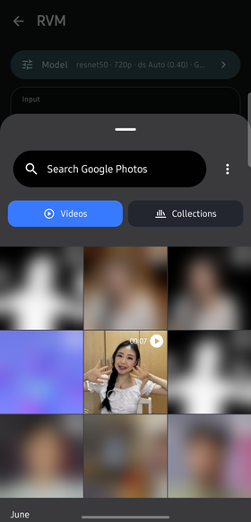

# RVM — User Guide

RVM separates a person from their background in a video, entirely on your phone. Nothing you
record or process is ever uploaded — the only thing the app downloads is the AI model itself.

Give it a clip, and you get three videos back:

| Output | What it is |
| --- | --- |
| **Matte** | A black-and-white mask: white where the subject is, black where the background is, grey at soft edges like hair. |
| **Foreground** | The subject's colours as the model recovers them, with the background's colour spill removed. |
| **Composite** | The subject on a black background, edges fading out smoothly instead of being hard-cut. This is the one most people want. |

---

## Contents

- [Installing](#installing)
- [First launch](#first-launch)
- [Making your first matte](#making-your-first-matte)
- [Saving your results](#saving-your-results)
- [Choosing a different model](#choosing-a-different-model)
- [Settings explained](#settings-explained)
- [Good to know](#good-to-know)
- [Troubleshooting](#troubleshooting)

---

## Installing

Download `rvm-<version>.apk` from the
[Releases page](https://github.com/Hardikagrwl03/On-Device-Robust-Video-Matting/releases) and open
it on your phone. Android will ask you to allow installing apps from your browser or file manager —
this is normal for apps not distributed through the Play Store.

**You need:**

- **Android 15 or newer.** The app won't install on older versions.
- A **64-bit ARM phone** — every phone that runs Android 15 qualifies.
- **About 1 GB free**: ~500 MB for the app, plus the models you download.
- **Wi-Fi for the first launch** (see below).

---

## First launch


The app needs an AI model before it can do anything, and models are too large to ship inside the
app. So on the very first launch it downloads two of them automatically — about **120 MB in
total**. Use Wi-Fi.

You don't have to wait for both. The smaller, faster model arrives first (~15 MB) and **Video
Matte** becomes tappable as soon as it lands — usually within a few seconds. The larger,
higher-quality model keeps downloading in the background.

While that's happening the Video Matte tile shows the progress. The counter on the **Models** tile
(`2/8` above) tells you how many of the eight available models you have.

> **No internet on first launch?** The app won't crash — the Video Matte tile will say *"Tap to
> download a model"* and take you to the Models page, where you can retry once you're connected.

---

## Making your first matte

### 1. Open Video Matte


*Live Matte* (real-time camera matting) isn't built yet — tapping it just shows a "coming soon"
message.

### 2. Tap **Import** and pick a video



For your first run, **choose something short — 5 to 10 seconds.** Processing takes roughly
**half a second per frame**, so a 10-second clip takes a couple of minutes, and a 2-minute clip
would take the better part of an hour.

The app works best on video shot **portrait at 720×1280**, with a person reasonably filling the
frame. Once picked, your clip appears in the **Input** panel and the app is ready to run:


### 3. Tap **Matte**


A progress bar shows which frame it's on. Your screen stays awake for the whole run.

You can tap **Cancel** to stop early. Leaving the app or letting the screen turn off will
interrupt the run, so it's best to leave it in the foreground.

### 4. Compare the results

| Matte | Composite |
| :---: | :---: |
|  |  |

Your original is on top, the result below. Use the **Matte / Foreground / Composite** switch to
change which result you're looking at, and press **play** — both videos play together, in sync, so
you can check the edges frame by frame.

The bottom line reports how long the run took and the average time per frame.

---

## Saving your results

Tap **Save**. All three videos are copied into your gallery under **Movies/RVM**, named:

```
RVM_matte_<date>_<time>.mp4
RVM_foreground_<date>_<time>.mp4
RVM_composite_<date>_<time>.mp4
```

> **Save before you move on.** Until you tap Save, results live in temporary storage. Tapping
> **Reset**, running another video, or Android reclaiming space will delete them.

---

## Choosing a different model


Tap **Models** on the home screen. Each entry shows how that model was built and how large it is.
Tap one to download it; it stays on your phone permanently. Downloaded models turn a highlighted
colour with a checkmark.

There are two model families:

- **MobileNetV3** (~15 MB) — noticeably faster, slightly softer edges. Good for long clips and
  quick tests. Around **320 ms per frame**.
- **ResNet50** (~104 MB) — slower but cleaner, especially around hair. Around **420 ms per frame**.

And two variants of each:

- **GPU-optimised builds** — recommended, and what the app downloads for you. These run entirely
  on your phone's graphics chip.
- **Upstream builds** — the unmodified original model, included for comparison. These **cannot**
  run on the GPU and are forced onto the CPU, which is much slower. **You almost certainly want
  the GPU-optimised ones.**

Results are identical either way; only speed differs.

> Downloads continue if you leave the Models page, but **not** if you close the app. A large
> download that gets interrupted starts over from the beginning.

---

## Settings explained

Tap the **Model** bar at the top of the matting screen.


| Setting | What it does |
| --- | --- |
| **Compute device** | Which chip does the work. **GPU** is fastest and the default. **CPU** is slower but always works. **NPU** uses the AI accelerator if your phone has a usable one. **AUTO** tries them in order. |
| **Source** | `gpu` or `original` — see [Choosing a different model](#choosing-a-different-model). Stick with `gpu`. |
| **Resolution** | The size the model runs at. Only 720 × 1280 is published today. |
| **Backbone** | `mobilenetv3` (fast) or `resnet50` (higher quality). |
| **Downsample ratio** | `Auto` lets the model work at a reduced internal size and refine the result back up — much faster, and the recommended setting. `100%` runs at full resolution: slower, marginally sharper. |
| **Threads** | CPU threads. Only matters when running on CPU. |

Only combinations you've actually downloaded appear here, so you can't pick something that doesn't
exist. Tap **Apply** to load the new model — this takes a few seconds while it's set up.

> If you pick an `original` model together with **GPU** or **NPU**, the app will tell you it's
> switching to CPU. That pairing genuinely cannot run — it's not a bug.

---

## Good to know

- **Everything runs on your phone.** Your videos are never uploaded. The only network use is
  downloading models from GitHub.
- **The output videos have no sound.** Only the picture is processed; audio isn't carried over.
- **Output is always 1280 × 720**, whatever your input was.
- **Processing is slow, and that's expected.** Roughly 0.3–0.5 seconds per frame means a
  30-frames-per-second clip takes about 10–15 seconds of processing per second of video.
- **Your phone will get warm** during a long run. That's normal.
- **Models stay downloaded forever.** To reclaim the space, clear the app's storage in Android
  Settings → Apps → RVM → Storage. They'll be re-downloaded next launch.

---

## Troubleshooting

**"The app won't install."**
It requires Android 15 or newer on a 64-bit ARM phone. Older versions of Android are not supported.

**"Video Matte says 'Tap to download a model'."**
No model finished downloading. Tap it to open the Models page, check your connection, and tap any
model with a retry icon.

**"A download failed."**
Failed entries turn red with a circular retry arrow and a reason ("No internet connection",
"Connection timed out", "Not enough storage"). Tap to try again.

**"Processing is extremely slow."**
Check the **Model** bar. If it says `CPU`, open the settings and switch **Compute device** to
`GPU` — and make sure **Source** is `gpu`, since `original` models are forced onto the CPU.
Switching **Backbone** to `mobilenetv3` is roughly 25% faster again.

**"The edges look rough around hair."**
Try `resnet50` instead of `mobilenetv3`, or set **Downsample ratio** to `100%`. Both are slower.
Good, even lighting on your subject helps more than either setting.

**"My results disappeared."**
They were never saved. Results are temporary until you tap **Save** — see
[Saving your results](#saving-your-results).

**"The subject isn't detected properly."**
The model is trained on people. It works best with a person clearly visible, well lit, and
reasonably large in the frame. It won't segment objects or animals reliably.
